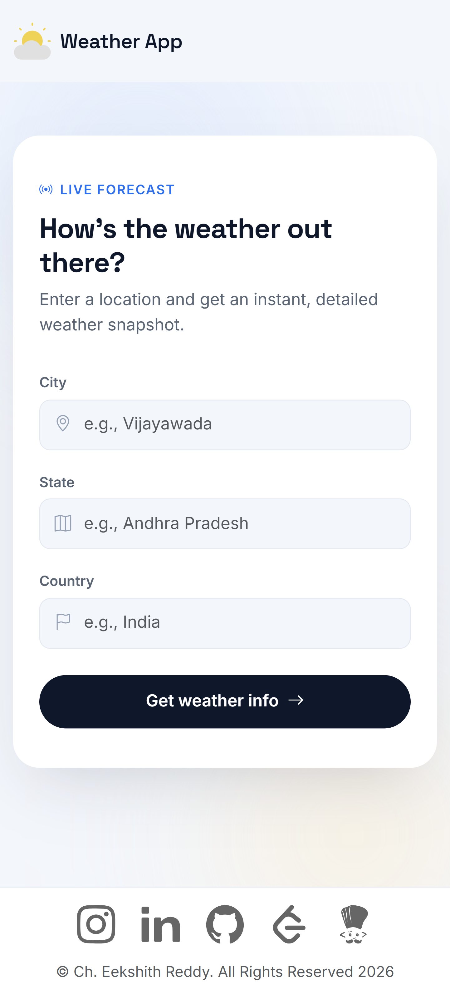
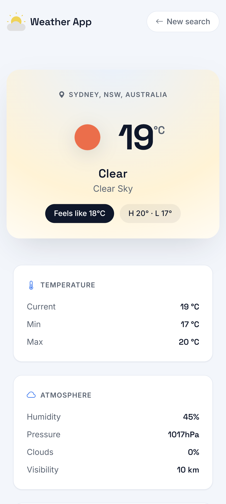
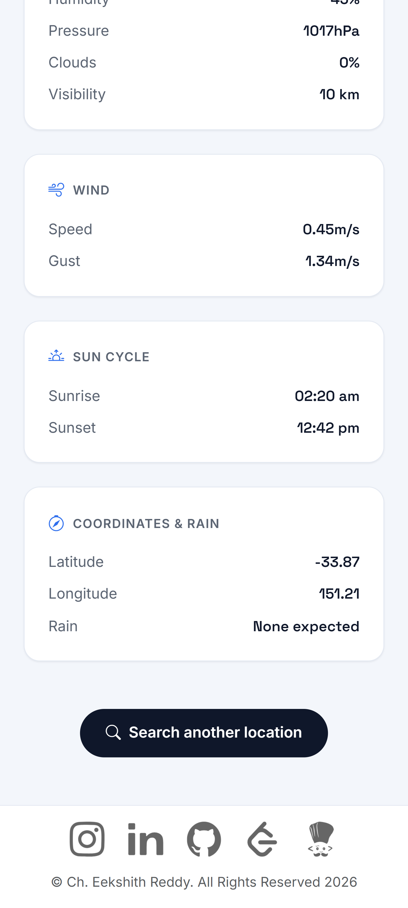

# Weather Application


A modern weather web application built with Node.js, Express.js, EJS, OpenWeatherMap API, and Geoapify Geocoding API. Search for any city to view real-time weather conditions through a clean, responsive, and minimalist user interface.

---

##  Features

- Search weather by city name
- Real-time temperature and "Feels Like" temperature
- Weather condition with official weather icons
- Humidity, pressure, cloud coverage, and visibility
- Wind speed and gust information
- Sunrise and sunset timings
- Latitude and longitude
- Rainfall information (when available)
- Dynamic weather-themed hero card
- Fully responsive layout using Bootstrap 5
- Fast server-side rendering with EJS

---

##  Tech Stack

### Frontend
- HTML5
- CSS3
- Bootstrap 5
- Bootstrap Icons
- EJS Templates
- Google Fonts (Inter & Space Grotesk)

### Backend
- Node.js
- Express.js

### APIs
- Geoapify API
- OpenWeatherMap Current Weather API

---

## 📂 Project Structure

```text
Weather-Application/
│
├── public/
│   ├── images/
│   └── styles/
│       └── main.css
│
├── screenshots/
│   
├── views/
│   ├── partial/
│   │   └── footer.ejs
│   ├── index.ejs
│   └── weather.ejs
│
├── .env.example
├── index.js
├── package.json
└── README.md
```
---

## 📋 Requirements

- Node.js (v18 or later recommended)
- npm
- Geoapify API Key
- OpenWeatherMap API Key

---

## Installation

### 1. Clone the repository

```bash
git clone https://github.com/eekshith127/Weather-Application.git
```

### 2. Navigate to the project directory

```bash
cd Weather-Application
```

### 3. Install the dependencies

```bash
npm install
```

### 4. Create a `.env` file

Create a `.env` file in the project root and add the following environment variables:

```env
PORT=3000
GEOAPIFY_API_KEY=YOUR_GEOAPIFY_API_KEY
OPENWEATHER_API_KEY=YOUR_OPENWEATHER_API_KEY
```

### 5. Start the application

Production:

```bash
npm start
```

Development (auto-restarts on changes):

```bash
npm run dev
```

### 6. Open the application

Open your browser and visit:

```
http://localhost:3000
```

---

##  Screenshots

### Desktop

<p align="center">
  
  
</p>

### Mobile

<p align="center">
  
  
  
</p>

---

## 🌍 APIs Used

This project uses the following APIs:

- **[OpenWeatherMap Current Weather API](https://openweathermap.org/current)**
- **[Geoapify Geocoding API](https://www.geoapify.com/geocoding-api/)**
---

## 💡 Future Improvements

- 5-day weather forecast
- Air Quality Index (AQI)
- Geolocation support
- Weather maps
- Unit conversion (°C / °F)
- Recent search history
- Dark mode
- Weather alerts

---

## 📖 What I Learned

While building this project, I learned:

- Building web applications with Express.js
- Server-side rendering using EJS
- Working with REST APIs
- Handling asynchronous requests
- Creating responsive UI using Bootstrap
- Organizing CSS with reusable design tokens
- Displaying dynamic data in templates

---

##  Contributing

Contributions, suggestions, and improvements are welcome.

Feel free to fork the repository and submit a pull request.

---

##  License

This project is licensed under the MIT License.

---

## Author

**Ch. Eekshith Reddy**

- B.Tech, Computer Science Engineering
- Indian Institute of Information Technology, Raichur

GitHub: https://github.com/eekshith127
